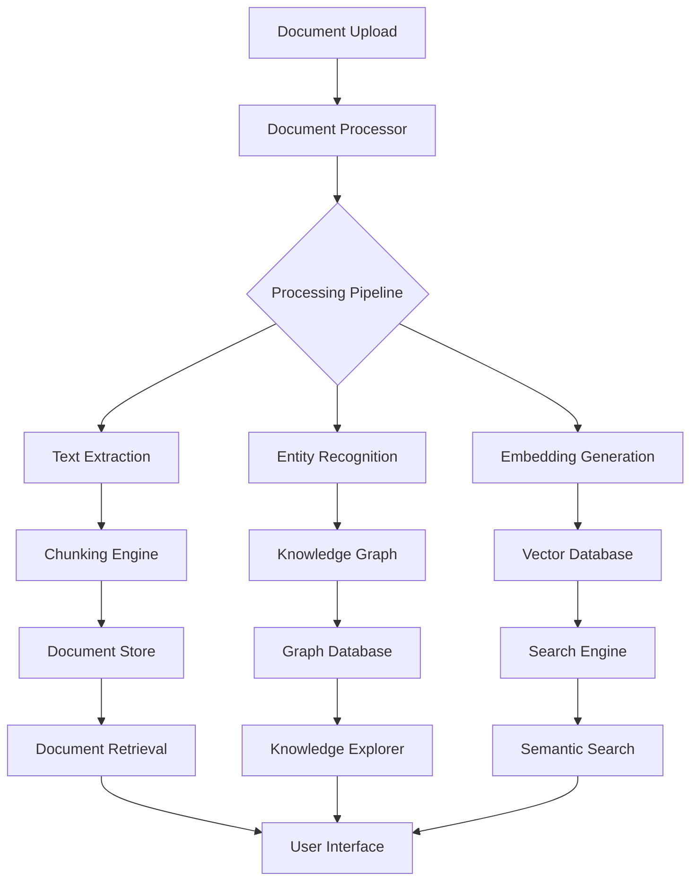

# 🌟 DOCUMENT INTELLIGENCE FRAMEWORK 🌟

<div align="center">
  
  
  [](LICENSE)
  [](https://www.python.org/)
  [](https://flask.palletsprojects.com/)
  
  <br>
  
  <p align="center">
    
  </p>
  
  <h3>
    <strong>Transform Your Documents into Intelligent Knowledge Networks</strong>
  </h3>
  
  <p align="center">
    <a href="#-key-features">Features</a> •
    <a href="#-architecture">Architecture</a> •
    <a href="#-installation">Installation</a> •
    <a href="#-usage">Usage</a> •
    <a href="#-visualization">Visualization</a> •
    <a href="#-roadmap">Roadmap</a>
  </p>
  
</div>

<br>

## 🚀 INTRODUCTION

**Document Intelligence Framework (DIF)** is a groundbreaking system that transcends traditional document management. It transforms static documents into dynamic knowledge networks, enabling unprecedented insights, connections, and intelligence extraction.

> **"Where documents become alive with connections and knowledge"**

<div align="center">
  
</div>

<br>

## ✨ KEY FEATURES

<table>
  <tr>
    <td width="33%" align="center">
      <br>
      <b>AI-Powered Processing</b><br>
      <small>Advanced document understanding with neural networks</small>
    </td>
    <td width="33%" align="center">
      <br>
      <b>Knowledge Graph</b><br>
      <small>Dynamic entity and relationship mapping</small>
    </td>
    <td width="33%" align="center">
      <br>
      <b>Vector Retrieval</b><br>
      <small>Semantic search with embedding technology</small>
    </td>
  </tr>
  <tr>
    <td width="33%" align="center">
      <br>
      <b>Secure Storage</b><br>
      <small>End-to-end encryption for sensitive documents</small>
    </td>
    <td width="33%" align="center">
      <br>
      <b>3D Visualization</b><br>
      <small>Interactive exploration of document relationships</small>
    </td>
    <td width="33%" align="center">
      <br>
      <b>Natural Language</b><br>
      <small>Intuitive querying in human language</small>
    </td>
  </tr>
</table>

<br>

### 🔮 Next-Gen Capabilities

- **Neural Document Processing**: Transforms documents into structured knowledge
- **Entity Recognition & Linking**: Automatically identifies and connects key concepts
- **Intelligent Semantic Search**: Finds information based on meaning, not just keywords
- **Multi-Modal Understanding**: Processes text, images, and charts as unified content
- **Knowledge Graph Generation**: Creates visual networks of connected information
- **Secure Document Management**: Role-based access with end-to-end encryption
- **Adaptive Learning**: Improves understanding with every document processed
- **Real-time Collaboration**: Simultaneous multiuser document exploration

<br>

## 🏗️ ARCHITECTURE

<div align="center">
  
</div>

<br>

The Document Intelligence Framework employs a modular, microservice-based architecture:



<br>

## 💾 INSTALLATION

### Prerequisites

- Python 3.9+
- PostgreSQL 13+
- Neo4j 4.4+ (for Knowledge Graph)
- Redis 6.2+ (for caching)

### Quick Start

```bash
# Clone the repository
git clone https://github.com/DeAtHfIrE26/Document_Intelligence_Framework.git
cd Document_Intelligence_Framework

# Set up virtual environment
python -m venv venv
source venv/bin/activate  # On Windows: venv\Scripts\activate

# Install dependencies
pip install -r requirements.txt

# Configure environment
cp .env.example .env
# Edit .env with your configuration

# Initialize database
flask db upgrade

# Run the application
flask run
```

<br>

## 🎮 USAGE

### Document Processing

```python
from services.document_processor import process_document

# Process a new document
document_id = process_document(
    file_path="path/to/document.pdf",
    user_id=user.id,
    extract_entities=True,
    generate_embeddings=True,
    build_knowledge_graph=True
)
```

### Semantic Search

```python
from services.query_processor import process_query
from services.retrieval_service import retrieve_documents

# Process and execute a search query
query_embedding = process_query("What are the key factors influencing climate change?")
results = retrieve_documents(query_embedding, top_k=5)

# Display results
for result in results:
    print(f"Document: {result.document.title}")
    print(f"Relevance: {result.relevance_score:.2f}")
    print(f"Context: {result.context_window}")
```

### Knowledge Graph Navigation

```python
from services.knowledge_graph import get_entity_relationships

# Explore relationships from a starting entity
relationships = get_entity_relationships("Climate Change", depth=2)

# Visualize the knowledge network
visualize_graph(relationships)
```

<br>

## 🌈 VISUALIZATION

<div style="display: flex; justify-content: space-between; flex-wrap: wrap;">
  <div style="flex: 1; min-width: 300px; margin: 10px;">
    
    <p align="center"><strong>Dynamic Knowledge Graph</strong></p>
  </div>
  <div style="flex: 1; min-width: 300px; margin: 10px;">
    
    <p align="center"><strong>Interactive Document Explorer</strong></p>
  </div>
</div>

<div style="display: flex; justify-content: space-between; flex-wrap: wrap;">
  <div style="flex: 1; min-width: 300px; margin: 10px;">
    
    <p align="center"><strong>Intelligent Semantic Search</strong></p>
  </div>
  <div style="flex: 1; min-width: 300px; margin: 10px;">
    
    <p align="center"><strong>Advanced Document Analysis</strong></p>
  </div>
</div>

<br>

## 🛠️ TECHNOLOGIES

<div align="center">
  
  
  
  
  
  
  
  
  
  
</div>

<br>

## 🗺️ ROADMAP

<div align="center">
  <table>
    <tr>
      <td align="center">
        
        <br><b>Phase 1</b>
        <br><small>Core Engine</small>
      </td>
      <td align="center">
        
        <br><b>Phase 2</b>
        <br><small>Advanced Features</small>
      </td>
      <td align="center">
        
        <br><b>Phase 3</b>
        <br><small>Enterprise Integration</small>
      </td>
      <td align="center">
        
        <br><b>Phase 4</b>
        <br><small>AI Augmentation</small>
      </td>
    </tr>
  </table>
</div>

### Upcoming Features

- **Multimodal Document Processing**: Support for images, videos, and audio transcription
- **Advanced Entity Resolution**: Cross-document entity linking and disambiguation
- **Collaborative Knowledge Editing**: Team-based knowledge graph refinement
- **Custom Ontology Support**: Domain-specific knowledge modeling
- **API Ecosystem**: Developer tooling for custom integrations
- **Augmented Reality Visualization**: Spatial exploration of knowledge networks
- **Voice Interface**: Natural language voice commands and queries

<br>

## 👥 CONTRIBUTION

Contributions are welcome! Check out our [Contribution Guidelines](CONTRIBUTING.md) to get started.

<br>

## 📜 LICENSE

This project is licensed under the MIT License - see the [LICENSE](LICENSE) file for details.

<br>

<div align="center">
  <h3>🌐 Connect With Us</h3>
  
  <a href="https://github.com/DeAtHfIrE26"></a>
  <a href="#"></a>
  <a href="#"></a>
  <a href="#"></a>
  
  <p>
    <br>
    <em>Created with ❤️ by <a href="https://github.com/DeAtHfIrE26">DeAtHfIrE26</a></em>
    <br><br>
    <a href="#-document-intelligence-framework-">Back to Top ⬆️</a>
  </p>
</div> 